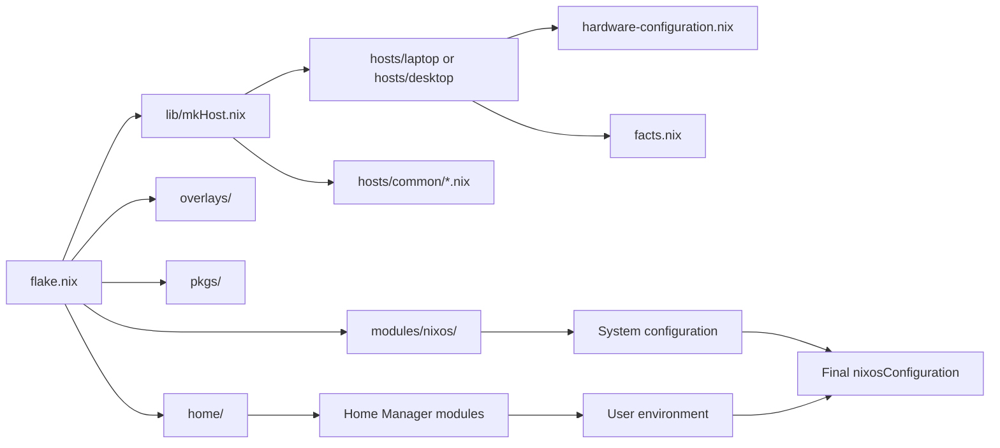
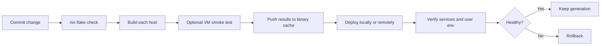

# Best Practices for a Single Flake-Based NixOS Configuration Across Multiple Machines with Home Manager

## Executive summary

For a laptop-and-desktop setup managed from one Git repository, the highest-confidence pattern is a **single flake with a committed lock file**, a **shared module library**, **thin host entrypoints**, **Home Manager integrated as a NixOS module** when all target machines are NixOS, and **hardware-specific configuration isolated from role and user configuration**. This keeps evaluation predictable, makes upgrades auditable, and preserves the main benefit of the NixOS module system: many small modules merged into one final system closure. The Nix module system explicitly supports static `imports`, reusable modules, `specialArgs`, and precedence controls such as `mkIf`, `mkMerge`, `mkDefault`, `mkForce`, `mkBefore`, and `mkAfter`; overlays are applied in order and are best kept centralized because each additional Nixpkgs recomputation is costly. citeturn19search1turn31search0turn32search0

For pinning, the modern default is to use **flake inputs plus `flake.lock`**, with `inputs.<name>.follows` where appropriate so that `home-manager`, `sops-nix`, and similar dependencies share the same `nixpkgs` and do not silently pull in duplicate or stale recursive inputs. Channels remain valid but are intentionally moving references via `NIX_PATH`, while flakes create a locked dependency graph for reproducibility. If you need a non-flake or hybrid workflow, `npins` is the cleanest contemporary replacement for `niv`; `npins` is specifically documented as a simple pinning tool inspired by and comparable to `niv`, and it includes a migration path from `niv`. citeturn25search1turn25search7turn25search3turn12search2turn33search0turn33search2turn12search0

For secrets, the safest baseline is **never place cleartext secrets into the Nix store**, because the store is world-readable. In practice, the best fit for most flake-based NixOS fleets is **`sops-nix`** for team-friendly secret rotation and mixed recipients, or **`agenix`** for a simpler SSH-key/`age` workflow. `git-crypt` is useful for protecting repository contents at Git checkout time, but it is not a full runtime secret-provisioning system for NixOS in the way `sops-nix` and `agenix` are. citeturn40search8turn40search1turn3search0turn3search8turn3search1turn3search2

For operations, the lowest-risk workflow is: **evaluate and build locally in CI**, **publish build outputs to a signed binary cache**, **test with `nixos-rebuild test` or `build-vm` for risky changes**, then **switch or deploy**. NixOS supports `build`, `test`, `boot`, `switch`, `build-vm`, and `--rollback`; Home Manager has rollback support as well. For CI/CD, GitHub Actions is the easiest hosted option, GitLab CI is entirely workable, and Hydra is still the canonical Nix-native dedicated CI service if you want self-hosted Nix-first continuous builds. citeturn26search0turn27search1turn4search0turn4search18turn5search4turn5search5

The most important architectural advice is simple: **make hosts thin, keep modules composable, and centralize only what truly is shared**. A host should mostly describe “what machine is this?” while reusable modules describe “what feature or concern is this?” That makes per-host overrides smaller, hardware isolation cleaner, and onboarding much easier. Exemplary community repositories repeatedly converge on some variation of this pattern, even when they use different composition styles such as host-first trees, exported module libraries, or the “broadcast-and-gate” pattern. citeturn7search2turn7search3turn7search8turn7search13turn7search17

## Recommended architecture and repository layout

The NixOS module system encourages decomposition into many modules and static imports, and `specialArgs` exists precisely so callers can pass shared context during import resolution. In a multi-machine flake, that translates well into a layered structure: shared modules, role modules, host modules, user modules, overlays, packages, and secrets. The resulting repository should optimize for **discoverability**, **small diffs**, **host locality**, and **minimal duplication**. citeturn19search1turn32search0

A practical, scalable layout for one user operating multiple NixOS machines is:

```text
.
├── flake.nix
├── flake.lock
├── lib/
│   ├── mkHost.nix
│   ├── mkHome.nix
│   └── default.nix
├── hosts/
│   ├── common/
│   │   ├── base.nix
│   │   ├── desktop.nix
│   │   ├── laptop.nix
│   │   └── users.nix
│   ├── laptop/
│   │   ├── default.nix
│   │   ├── hardware-configuration.nix
│   │   └── facts.nix
│   └── desktop/
│       ├── default.nix
│       ├── hardware-configuration.nix
│       └── facts.nix
├── modules/
│   ├── nixos/
│   │   ├── networking.nix
│   │   ├── printing.nix
│   │   ├── ssh.nix
│   │   ├── power.nix
│   │   ├── gpu.nix
│   │   └── fonts.nix
│   ├── home/
│   │   ├── shell.nix
│   │   ├── git.nix
│   │   ├── editor.nix
│   │   └── desktop-apps.nix
│   └── shared/
│       ├── options.nix
│       └── assertions.nix
├── home/
│   └── clement/
│       ├── common.nix
│       ├── laptop.nix
│       └── desktop.nix
├── overlays/
│   ├── default.nix
│   └── rust.nix
├── pkgs/
│   ├── default.nix
│   └── my-tool.nix
├── secrets/
│   ├── README.md
│   ├── .sops.yaml
│   └── ...
├── checks/
│   └── vm-smoke.nix
├── docs/
│   ├── BOOTSTRAP.md
│   ├── OPERATIONS.md
│   └── DECISIONS.md
└── .github/workflows/
    ├── ci.yml
    └── update-flake-lock.yml
```

This layout matches what the official module system makes easy and what exemplary public flakes tend to converge on: per-host directories, shared modules, reusable Home Manager modules, overlays, and a thin top-level flake. `flake-parts` can help if the flake grows large, because it mirrors the flake schema and formalizes `perSystem`, but it is optional rather than mandatory. `flake-utils` is lighter and provides pure utility functions if you want fewer moving parts. citeturn19search1turn8search0turn8search8turn8search1turn7search2turn7search3turn7search13turn7search17

A good mental model is:



The most robust composition rule is to keep **host entrypoints thin**. A host file should mostly import shared modules, one or two role modules, its generated hardware configuration, and tiny host-local overrides. That avoids the two most common long-term problems in personal flakes: giant monolithic host files and hidden cross-host coupling. The NixOS manual’s description of modules, imports, static import resolution, and override ordering is exactly why this works well. citeturn32search0turn19search1

### A recommended `flake.nix`

The snippet below follows the official flake model, keeps `nixpkgs` pinned in `flake.lock`, makes Home Manager follow the same `nixpkgs`, and centralizes host construction. It also shows how to pass common context via `specialArgs`, which the module system explicitly supports for import-time access. citeturn25search1turn25search7turn19search1

```nix
{
  description = "Clement's multi-machine NixOS + Home Manager configuration";

  inputs = {
    nixpkgs.url = "github:NixOS/nixpkgs/nixos-26.05";

    home-manager = {
      url = "github:nix-community/home-manager/release-26.05";
      inputs.nixpkgs.follows = "nixpkgs";
    };

    sops-nix = {
      url = "github:Mic92/sops-nix";
      inputs.nixpkgs.follows = "nixpkgs";
    };

    nixos-hardware = {
      url = "github:NixOS/nixos-hardware";
      inputs.nixpkgs.follows = "nixpkgs";
    };

    flake-utils.url = "github:numtide/flake-utils";
  };

  outputs = inputs@{ self, nixpkgs, home-manager, sops-nix, nixos-hardware, ... }:
    let
      lib = nixpkgs.lib;

      mkHost = { hostname, system, extraModules ? [ ] }:
        lib.nixosSystem {
          inherit system;
          specialArgs = {
            inherit inputs hostname;
          };
          modules =
            [
              ./hosts/common/base.nix
              ./hosts/common/users.nix
              ./hosts/${hostname}/default.nix

              home-manager.nixosModules.home-manager
              sops-nix.nixosModules.sops
            ]
            ++ extraModules;
        };
    in {
      nixosConfigurations = {
        laptop = mkHost {
          hostname = "laptop";
          system = "x86_64-linux";
          extraModules = [
            nixos-hardware.nixosModules.lenovo-thinkpad-x1-9th-gen
          ];
        };

        desktop = mkHost {
          hostname = "desktop";
          system = "x86_64-linux";
        };
      };
    };
}
```

### Host entrypoints should be declarative and narrow

The host file should answer: what makes this machine different from the fleet default? It should not restate common configuration unless the host truly diverges. Generated hardware files should remain isolated because `nixos-generate-config` writes them and the manual explicitly says they are typically auto-generated and generally should not be modified directly. citeturn2search0

```nix
# hosts/laptop/default.nix
{ inputs, hostname, lib, pkgs, ... }:
{
  imports = [
    ./hardware-configuration.nix
    ../../modules/nixos/networking.nix
    ../../modules/nixos/power.nix
    ../../modules/nixos/gpu.nix
    ../../home/clement/laptop.nix
  ];

  networking.hostName = hostname;

  services.fwupd.enable = true;
  services.upower.enable = true;

  # Example laptop-local tweak
  powerManagement.cpuFreqGovernor = lib.mkDefault "powersave";
}
```

## Modularization, composition, overlays, and Home Manager boundaries

The cleanest multi-machine organizational scheme is usually **hybrid** rather than purely per-host or purely per-role. In practice:

- **Per-host** is where you place hostname, filesystem layout, boot quirks, NIC names, GPU topology, and machine-only exceptions.
- **Per-role** is where you place concerns like workstation, laptop, gaming, development, server, media, printing, or secure-boot.
- **Per-environment** is where you place differences like home, office, travel, or headless.
- **Per-user / Home Manager** is where you place shells, editors, dotfiles, desktop apps, and user services. citeturn32search0turn38search1

The trade-offs are:

| Pattern | Best use | Strengths | Risks | Primary evidence |
|---|---|---|---|---|
| Per-host | Small fleets, clear hardware boundaries | Easy to find machine-specific config | Duplicates shared behavior over time | NixOS module imports/host files are natural composition units. citeturn32search0turn19search1 |
| Per-role | Reusing features across many machines | High reuse, smaller host files | Role interactions can become implicit | Module merging and conditional composition support this well. citeturn32search0 |
| Per-environment | Travel/home/work or GUI/headless deltas | Good for toggling bundles of behavior | Can become a second role system if overused | `mkIf`, `mkMerge`, and statically known imports make this practical. citeturn32search0 |
| Broadcast-and-gate | Very large personal/homelab flakes | Centralized module library, typed host facts | Harder to reason about without strong documentation | Public example: wimpysworld’s “broadcast-and-gate” pattern. citeturn7search8 |

My recommendation for one user managing a laptop and desktop is: **per-host directories + shared role modules + one user’s Home Manager split into common and host-specific files**. That captures the ergonomic sweet spot shown by starter and mature community flakes without overengineering. citeturn7search2turn7search3turn7search17

### Home Manager integration

Home Manager officially supports three main modes: standalone, NixOS module, and nix-darwin module. For an all-NixOS repo, **using Home Manager as a NixOS module** is usually the best fit because `nixos-rebuild` builds system and home together as one deployable generation. Home Manager’s own README also explains that its release branches correspond to NixOS releases, while `master` tracks `nixpkgs-unstable`, so matching the Home Manager branch to your NixOS release is the safest stable strategy. citeturn38search1turn28search0

A good default for integrated Home Manager is:

```nix
# hosts/common/users.nix
{ inputs, ... }:
{
  users.users.clement = {
    isNormalUser = true;
    extraGroups = [ "wheel" "networkmanager" ];
  };

  home-manager = {
    useGlobalPkgs = true;
    useUserPackages = true;

    extraSpecialArgs = {
      inherit inputs;
    };

    users.clement = import ../../home/clement/common.nix;
  };
}
```

This pattern is popular because `useGlobalPkgs = true` makes Home Manager reuse the system-level Nixpkgs package set instead of importing a separate one, which avoids mismatches in overlays and global package settings. The Home Manager issue history explicitly frames `useGlobalPkgs` as the solution to using the global pkgs configuration from the NixOS-module mode. The practical caveat is that once you do this, **Home Manager-local `nixpkgs` overlays/settings are no longer the place to customize packages**; keep those at the system flake or overlay layer instead. citeturn38search2turn38search3turn16search3

The system/user boundary should be drawn like this:

| Put it in NixOS | Put it in Home Manager | Why |
|---|---|---|
| Bootloader, disks, filesystems, firmware, kernel, system services, networking, firewall, hardware modules | Shells, editors, dotfiles, user packages, user services, desktop UX preferences | Home Manager is specifically for user environments, while NixOS modules own the machine. citeturn38search1turn26search0turn21search2 |
| Machine-wide packages needed for all users or system activation | Personal packages and app configuration | Keeps host closure and home closure conceptually separate. citeturn38search1 |
| Secrets needed by root-owned services | User-scoped secrets if the secret tool supports HM integration | `sops-nix` has both system and Home Manager support. citeturn3search8 |

### Overlays and package customization

The official Nixpkgs manual defines overlays as functions of `final` and `prev`, applied **in order**, and explicitly notes that repeated fixpoint recomputation via `pkgs.extend`/`appendOverlays` is relatively expensive. In a multi-machine flake, the best practice is therefore to **centralize overlays near the flake root** and keep them small, composable, and documented. citeturn31search0

```nix
# overlays/default.nix
final: prev: {
  my-neovim =
    prev.neovim.overrideAttrs (old: {
      meta = old.meta // {
        description = "Customized Neovim package for my fleet";
      };
    });
}
```

Common overlay rules that age well:

- Keep overlays for **package-set-wide changes** or reusable custom packages.
- Prefer `overrideAttrs` or package arguments for **single-package changes**.
- Avoid host-specific logic inside overlays unless it is parameterized and truly unavoidable.
- If a customization is only used once, put it close to the consumer rather than in a global overlay. citeturn31search0

### Module precedence and cross-machine overrides

Cross-machine inheritance works best when the **shared module defines defaults** and the **host module tightens or replaces them** using module priorities. The official module system provides exactly the right tools: `mkDefault` for defaults, `mkForce` for low-level escape hatches, and `mkBefore`/`mkAfter` for list ordering. citeturn32search0

```nix
# modules/nixos/power.nix
{ lib, ... }:
{
  powerManagement.cpuFreqGovernor = lib.mkDefault "schedutil";
}

# hosts/laptop/default.nix
{ lib, ... }:
{
  powerManagement.cpuFreqGovernor = lib.mkForce "powersave";
}
```

This is usually better than branching deeply inside shared modules. If a module must be conditional, prefer `mkIf` so the conditional is pushed down into definitions correctly; the manual explicitly documents this as the correct pattern that avoids infinite recursion. citeturn32search0

## Reproducibility, pinning, secrets, security, and hardware-specific configuration

Flakes are still documented as experimental, and the current stabilization RFC history makes clear that a final flakes design still requires further RFC work. That means the safest production posture is not “assume flakes are fully settled,” but rather “use flakes deliberately, keep lock files committed, and make the flake a thin wrapper around modular Nix code.” citeturn19search2turn6search0

### Pinning and reproducible inputs

The official flake reference says reproducibility comes from `flake.lock`, which stores a locked graph mapping unlocked input references to exact locked versions. `nix flake lock` and `nix flake update` are the primary lifecycle commands. The official flakes docs also warn that if you do not use `follows`, recursive inputs can drift or duplicate. citeturn25search1turn25search7turn25search3

The practical hierarchy is:

| Approach | Recommendation | Why | Primary evidence |
|---|---|---|---|
| Flake inputs + committed `flake.lock` | Default for new multi-machine flakes | Reproducible locked graph; first-class flake workflow | citeturn25search1turn25search7 |
| `follows` on shared `nixpkgs` | Strongly recommended | Prevents duplicate/stale recursive inputs | citeturn25search3 |
| Channels | Legacy / compatibility only | Channels are moving references via `NIX_PATH` | citeturn12search2turn12search6 |
| `npins` | Best non-flake/hybrid alternative | Modern pin file workflow; `niv`-like; migration path from `niv` | citeturn33search0turn33search2turn33search4 |
| `niv` | Legacy maintenance mode choice | Uses `sources.json`; still works, but flakes/npins are more current | citeturn12search0turn33search0 |

Useful commands:

```bash
nix flake metadata
nix flake show
nix flake lock --update-input nixpkgs
nix flake update
nix flake check --no-update-lock-file
```

For source hygiene, use `lib.fileset` or `cleanSourceWith`-style filtering when packaging local source trees so you do not accidentally drag unrelated files into builds. The fileset documentation specifically notes that files are not added to the store until explicitly requested, which is valuable for both performance and avoiding accidental inclusion of sensitive files. citeturn40search6turn33search5

### Secrets management

The safest general rule is: **do not use Nix paths or `builtins.readFile` for secret material** unless you fully intend that data to enter the store. The NixOS manual explicitly warns that Nix paths are copied into the world-readable store, and `agenix` states the same more bluntly: all files in the Nix store are readable by any system user. citeturn40search1turn40search8

A practical comparison:

| Tool | Strong fit | Strengths | Weaknesses | Recommendation |
|---|---|---|---|---|
| `sops-nix` | Teams, mixed recipients, HM + NixOS | Atomic upgrades, rollback support, HM module, scalable crypto model | Slightly more setup complexity | Best default if multiple people or devices need shared secret workflows. citeturn3search0turn3search8 |
| `agenix` | Single user / SSH-key-centric fleets | Simple `age` model using SSH keys; minimal conceptual surface | Less featureful for some team workflows | Excellent simple default for one-user personal fleets. citeturn3search1turn40search8 |
| `git-crypt` | Mixed public/private repo content at Git layer | Transparent repo encryption, graceful degradation for non-keyholders | Not a runtime NixOS secret deployment system | Use only if you specifically need repo-at-rest encryption, not as your only NixOS secret story. citeturn3search2 |

A representative `sops-nix` pattern:

```nix
# inside a NixOS module
{ config, ... }:
{
  sops.defaultSopsFile = ../../secrets/common.yaml;
  sops.secrets."tailscale/authkey" = {
    owner = "root";
    mode = "0400";
  };

  services.tailscale = {
    enable = true;
    authKeyFile = config.sops.secrets."tailscale/authkey".path;
  };
}
```

And a representative `agenix` pattern:

```nix
# inside a NixOS module
{ config, ... }:
{
  age.secrets.github-token.file = ../../secrets/github-token.age;

  environment.etc."github-token".source =
    config.age.secrets.github-token.path;
}
```

For key distribution, the key operational principle is to **bind decryptability to the machine or user identities that actually need access**, not to generic long-lived shared secrets. `agenix` is built around SSH public/private keys, and `sops-nix` supports team workflows with scalable recipient handling. citeturn3search1turn3search0

### Security and least privilege

Several security practices arise directly from the source material:

- Keep secrets **out of the store** and feed services file paths or runtime credentials instead. NixOS release notes increasingly move options from inline secret strings to `*File` or systemd credential mechanisms precisely to avoid world-readable store leakage. citeturn40search7turn3search11
- Keep the firewall default-on posture unless there is a strong reason not to; the NixOS manual states the firewall is enabled by default. citeturn21search2
- Require **signed binary cache paths**. `require-sigs` defaults to true, and trusted cache verification comes from `trusted-public-keys` or private signing keys. citeturn30search0turn30search3turn30search4
- Separate cache-upload credentials from deployment credentials in CI/CD. This is an operational recommendation grounded in the fact that cache signing and deployment activation are distinct trust domains in Nix/Cachix workflows. citeturn4search12turn30search0

### Hardware-specific configuration

Hardware is where most multi-machine flakes become messy if boundaries are weak. The safest split is:

- **Generated hardware scan**: `hardware-configuration.nix`, mostly untouched.
- **Vendor/model profile**: `nixos-hardware` when available.
- **Machine-local quirks**: current host directory.
- **Reusable hardware policy modules**: GPU, power, Wi‑Fi, firmware, fwupd, touchpad, docking. citeturn2search0turn24search2

The official NixOS manual says `hardware-configuration.nix` is usually auto-generated by `nixos-generate-config` and generally should not be modified, because it will be overwritten by future runs. The same manual also notes that Wi‑Fi is not enabled by default in the generated config and that kernel modules may need adjustment for boot-critical storage. citeturn2search0

The `nixos-hardware` repository exists specifically as “a collection of NixOS modules covering hardware quirks,” with flake support and many model-specific modules. For laptops and unusual workstations, using an upstream model profile is almost always cleaner than carrying large piles of local quirks forever. citeturn24search2

A concise hardware checklist:

- Import `hardware-configuration.nix` and keep it isolated. citeturn2search0
- Use `nixos-hardware` if your model exists upstream. citeturn24search2
- Enable redistributable firmware if required by your hardware. citeturn20search1
- Enable `fwupd` on machines where firmware updates matter. citeturn21search0
- Prefer NetworkManager on desktops/laptops unless there is a strong reason not to; the manual documents it as the desktop path and notes that users should be in the `networkmanager` group. citeturn21search2
- Choose **one** laptop power stack. Nixpkgs explicitly documents a conflict between TLP power profile integration and `power-profiles-daemon`, because they use the same D-Bus interface. citeturn23search0
- Override GPU and hybrid-graphics quirks at the host/model layer, not in shared role modules. `nixos-hardware` profiles frequently encode these details. citeturn24search1turn24search2

## Testing, rollback, CI/CD, deployment, and binary caches

NixOS gives you unusually strong local testing and rollback primitives out of the box. The official manual documents `nixos-rebuild build`, `test`, `boot`, `switch`, `build-vm`, `repl`, and `--rollback`, while the Nix testing tutorial documents the `testers.runNixOSTest` framework for QEMU-backed integration tests, including multi-machine scenarios. citeturn26search0turn19search3

The conservative workflow for risky changes is:

```text
edit → nix flake check → nixos-rebuild build --flake .#host
→ nixos-rebuild test --flake .#host
→ nixos-rebuild build-vm --flake .#host
→ publish to cache → deploy switch/boot → rollback if needed
```

A deployment flow looks like:



### Local commands worth standardizing

For host builds and safe switches:

```bash
# Evaluate and build
nix flake check
sudo nixos-rebuild build --flake .#laptop
sudo nixos-rebuild test --flake .#laptop
sudo nixos-rebuild switch --flake .#laptop
sudo nixos-rebuild boot --flake .#laptop

# Roll back
sudo nixos-rebuild switch --rollback

# VM smoke test
sudo nixos-rebuild build-vm --flake .#desktop
./result/bin/run-*-vm
```

For standalone or separate Home Manager workflows:

```bash
home-manager switch --flake .#clement@laptop
home-manager switch --rollback
```

The split is important: if Home Manager is integrated as a NixOS module, `nixos-rebuild` is the main operational command; if Home Manager is standalone, `home-manager switch --flake` is the right entrypoint. citeturn26search0turn27search1turn28search3

### CI/CD options

| Option | Best fit | Strengths | Weaknesses | Primary evidence |
|---|---|---|---|---|
| GitHub Actions | Personal/public GitHub-hosted repos | Easy setup, strong ecosystem, Dependabot supports Nix `flake.lock` | Hosted runner variability, secrets live in GitHub | citeturn4search1turn4search4turn4search0 |
| GitLab CI | Self-hosted or GitLab-centric teams | Excellent control over runners, good self-hosting story | Slightly more manual Nix setup | citeturn4search2turn4search5turn4search18 |
| Hydra | Dedicated Nix-native CI | Nix-first continuous builds, jobsets, build farm story | More operational complexity | citeturn5search4turn5search5 |

A minimal GitHub Actions example:

```yaml
name: ci

on:
  pull_request:
  push:
    branches: [main]

jobs:
  build:
    runs-on: ubuntu-latest
    steps:
      - uses: actions/checkout@v4

      - uses: DeterminateSystems/nix-installer-action@main
      - uses: DeterminateSystems/magic-nix-cache-action@main

      - name: Check flake lock health
        uses: DeterminateSystems/flake-checker-action@main

      - name: Flake checks
        run: nix flake check --print-build-logs

      - name: Build laptop
        run: nix build .#nixosConfigurations.laptop.config.system.build.toplevel

      - name: Build desktop
        run: nix build .#nixosConfigurations.desktop.config.system.build.toplevel
```

This example reflects three source-backed patterns: install Nix via an action, optionally use Magic Nix Cache to cut build time, and use the flake checker for lock-file hygiene. citeturn29search7turn29search2

A minimal GitLab CI example:

```yaml
stages: [check, build]

variables:
  NIX_CONFIG: "experimental-features = nix-command flakes"

check:
  stage: check
  image: nixos/nix:latest
  script:
    - nix flake check --print-build-logs

build:laptop:
  stage: build
  image: nixos/nix:latest
  script:
    - nix build .#nixosConfigurations.laptop.config.system.build.toplevel
```

### Binary caches and deployment

The core Nix primitives are straightforward: **build once, copy or serve store paths, verify signatures everywhere**. The Nix manual documents HTTP, SSH, local, and S3 binary cache stores; custom caches are configured via `substituters` and `trusted-public-keys`; signing keys can be generated with `nix key generate-secret` or binary-cache-key tooling. citeturn30search1turn30search4turn30search3turn30search11turn30search14

Practical recommendations:

- Use **Cachix** first if you want the fastest path to a shared cache. Its docs explicitly recommend GitHub Actions and document GitLab CI, Hydra, and other CI integrations. citeturn4search0turn4search3turn4search18turn4search15
- Use a **private HTTP/S3 cache** when you want full ownership or sensitive internal outputs. Nix officially supports both. citeturn30search5turn30search14
- Pre-warm remote machines with `nix copy` or `nix-copy-closure` when needed. citeturn18search1turn18search5
- Consider `deploy-rs` or `colmena` once you want push-button multi-node deployment. Both are active flake-aware deployment tools; `deploy-rs` is focused on flake profiles, while `colmena` emphasizes stateless parallel deployment. citeturn11search0turn11search1

## Upgrades, debugging, documentation, and an actionable checklist

Upgrades are where discipline matters most. Flakes make upgrades controlled, but they do not make them risk-free. The NixOS and Home Manager sources together suggest a safe workflow: align release branches, update one input at a time when possible, run checks, inspect diffs, deploy with `test` or `boot` when appropriate, and keep rollback simple. Home Manager itself recommends matching release branches with NixOS releases, while NixOS release notes repeatedly emphasize careful migration around boot and initrd changes. citeturn28search0turn17search2turn26search1

### Upgrade and migration workflow

A sensible cadence is:

1. Keep `main` deployable.
2. Update `nixpkgs` and `home-manager` in a branch, preferably together if they share a release branch or both follow the same unstable pin. citeturn28search0turn25search7
3. Run `nix flake check` and build every host toplevel. citeturn25search9turn26search0
4. For risky changes, run `build-vm` or a NixOS integration test. citeturn26search0turn19search3
5. Prefer `nixos-rebuild boot` + reboot for kernel / initrd / filesystem-sensitive changes; NixOS release notes explicitly call out cases where `boot` is safer than `switch`. citeturn26search1
6. Roll forward deliberately and roll back fast if verification fails. citeturn26search0turn27search1

### Debugging and reproducibility tools

The most useful official tools to standardize in docs and muscle memory are:

| Tool | Use | Primary evidence |
|---|---|---|
| `nix config check` / historical `nix doctor` | Basic installation/system diagnostics | `nix doctor` was renamed to `nix config check` in Nix 2.20. citeturn10search4turn10search8 |
| `nix repl` | Interactive evaluation and exploration | Official REPL support documented. citeturn10search1turn10search9 |
| `nix derivation show` | See the JSON form of top-level or recursive derivations | Official derivation inspection command. citeturn10search11 |
| `nix why-depends` | Explain why a dependency is present | Official dependency-path debugger. citeturn10search3 |
| `nix store diff-closures` | Compare generations / closures | Official closure diff tool. citeturn10search2 |
| `nixos-rebuild repl` | Explore the evaluated system config directly | Official NixOS rebuild REPL. citeturn26search0 |

For personal workflows, `nix-tree` is also very useful to browse dependency graphs interactively. citeturn41search1

### Documentation and onboarding

Well-run configuration repositories behave like products, not like private scratchpads. GitHub’s own README guidance says a repository README should explain what the project is for, how to get started, where to get help, and who maintains it. For a multi-machine NixOS repo, that should translate into a short docs set:

- `README.md`: what this repo manages, supported hosts, basic commands.
- `docs/BOOTSTRAP.md`: how to recover or provision a new machine.
- `docs/OPERATIONS.md`: everyday commands, secrets, rollback, remote deployment.
- `docs/DECISIONS.md`: architecture decisions and trade-offs.
- `docs/HOSTS.md`: inventory, hardware notes, quirks, profiles. citeturn36search6

If provisioning fresh machines is part of your workflow, consider documenting `nixos-anywhere` or the newer `nixos-facter` report flow as optional bootstrap helpers. NixOS now documents `nixos-facter` as a way to generate hardware reports that can drive system configuration defaults for architecture, firmware, boot, graphics, and networking. citeturn20search0turn33search8

### Prioritized QoL tools and editor integrations

The most useful additions, in order of practical impact, are:

| Priority | Tool | Why it matters | Primary evidence |
|---|---|---|---|
| Very high | `direnv` + `nix-direnv` | Automatic project environments; `nix-direnv` speeds reloads and retains gcroots for cached shells | citeturn9search0turn9search6turn9search5 |
| Very high | `nixd` | Rich Nix language server with package/option support and eval cache integration | citeturn34search0 |
| High | `nil` | Mature incremental Nix language server alternative | citeturn34search1 |
| High | VS Code Nix IDE | Practical editor integration; works with `nil` or `nixd` | citeturn34search3turn34search14 |
| High | `nixfmt` | Official formatter for Nix code | citeturn35search0turn35search3 |
| High | `treefmt-nix` | Best way to unify formatting and expose `nix fmt`/`flake check` formatting checks across mixed-language repos | citeturn37search0 |
| Medium | `flake-parts` | Large-flake ergonomics, especially `perSystem` and reusable flake modules | citeturn8search0turn8search6 |
| Medium | `devshell` | Convenient project dev environments, but explicitly marked unstable | citeturn12search3 |
| Medium | `npins` | Strong pinning tool for non-flake or hybrid dependency management | citeturn33search0turn33search4 |
| Medium | `comma` | Ad hoc convenience for running packages without installing them | citeturn41search0 |

### Actionable checklist

Use this as the implementation checklist for a clean multi-machine personal flake:

- Commit `flake.lock`, and make all important inputs follow the same `nixpkgs` unless there is a deliberate reason not to. citeturn25search1turn25search3
- Match `home-manager` release branches to your NixOS release for stable systems. citeturn28search0
- Keep `flake.nix` thin; move reusable logic into `lib/`, `modules/`, `overlays/`, and `pkgs/`. citeturn19search1turn8search0
- Make hosts thin: import shared modules, role modules, hardware config, and only small host-local overrides. citeturn32search0turn2search0
- Keep `hardware-configuration.nix` separate and minimally edited. citeturn2search0
- Use `nixos-hardware` when your machine model is supported. citeturn24search2
- Integrate Home Manager as a NixOS module for all-NixOS fleets; use `useGlobalPkgs = true` unless you intentionally need a separate HM package set. citeturn38search1turn38search3turn38search2
- Put system-wide concerns in NixOS modules and personal UX in Home Manager modules. citeturn38search1
- Centralize overlays and keep them small; do not scatter them across hosts. citeturn31search0
- Use `mkDefault` in shared modules and `mkForce` sparingly in hosts when a host must override fleet defaults. citeturn32search0
- Keep secrets out of the store; prefer `sops-nix` or `agenix`. citeturn40search8turn3search0turn3search1
- Standardize CI on `nix flake check` plus building every host toplevel. citeturn25search9turn26search0
- Push CI outputs to a signed binary cache. citeturn30search0turn30search4
- Use `test`, `boot`, `build-vm`, and rollback intentionally during upgrades. citeturn26search0turn26search1
- Document bootstrap, deployment, rollback, and secrets procedures in `docs/`. citeturn36search6

### Prioritized source shortlist

The most useful primary sources for this topic are:

- **NixOS Manual** for module composition, `nixos-rebuild`, rollback, hardware generation, firewall/networking, and release notes. citeturn26search0turn2search0turn21search2turn17search2
- **Nix Reference Manual / nix.dev** for flakes, lock files, registries, binary caches, remote builds, debugging tools, and store behavior. citeturn25search1turn25search7turn30search4turn18search9turn10search11
- **Nixpkgs Manual** for overlays and package customization semantics. citeturn31search0
- **Home Manager README/manual** for integration modes, release-branch alignment, and user-environment scope. citeturn38search1turn28search0
- **`sops-nix` and `agenix` READMEs** for runtime secret provisioning patterns. citeturn3search0turn3search1
- **`nixos-hardware`** for hardware quirk modules and model profiles. citeturn24search2
- **Cachix docs** for cache-backed CI/CD flows. citeturn4search0turn4search3turn4search18
- **Hydra** for Nix-native dedicated CI. citeturn5search4turn5search5
- **Exemplary public flakes** such as Misterio77’s starter and full configs, wimpysworld’s typed-host pattern, and AlexNabokikh’s documented multi-host repo for pragmatic structure ideas. citeturn7search2turn7search3turn7search8turn7search17

### Open questions and limitations

A few details are necessarily environment-dependent and should be chosen per repo rather than treated as universal defaults:

- Whether you should use a **stable NixOS branch** or **`nixos-unstable`** is a policy choice; the source material supports both, provided Home Manager and shared inputs are aligned. citeturn28search0turn25search7
- The exact choice between **`sops-nix` and `agenix`** depends on whether you optimize for team-friendly secret administration or minimal personal complexity. Both are strong options. citeturn3search0turn3search1
- The best deployment tool beyond raw `nixos-rebuild` depends on whether you want simple push deployment, parallel fleet deployment, or a fully dedicated Nix-native CI/build-farm stack. citeturn11search0turn11search1turn5search4